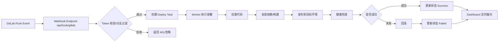
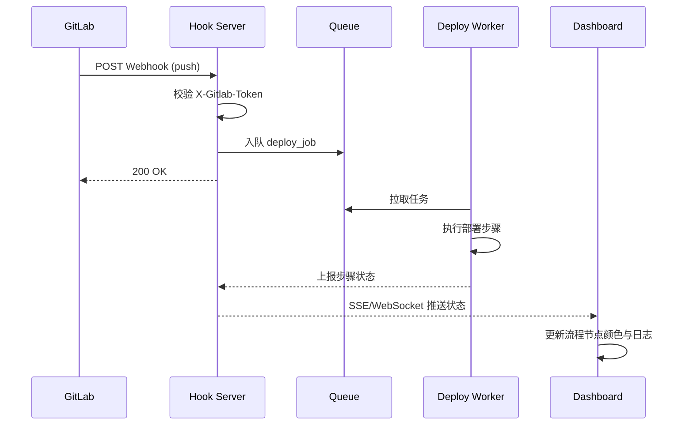

# GitLab Hook 触发部署与过程图形化展示

本文档用于指导你实现一个「GitLab Webhook 触发自动部署」系统，并在页面中图形化展示部署全过程。

## 1. 目标

- 当 GitLab 仓库发生 `push`（例如 `main` 分支）时，自动触发部署。
- 后端记录并实时更新部署步骤状态。
- 前端以可视化流程图 + 日志时间线方式展示部署过程。

## 2. 总体架构

- GitLab：发送 Webhook 事件。
- Hook Server（推荐 FastAPI）：接收事件、验签、入队。
- Deploy Worker：执行部署脚本（拉代码、构建、发布、健康检查）。
- Status Store（Redis/DB）：保存任务状态。
- Dashboard（前端）：通过 SSE/WebSocket 订阅状态并图形化展示。

## 3. 流程图（Mermaid）



## 4. 时序图（Mermaid）



## 5. GitLab Webhook 配置

在 GitLab 项目中设置：

1. `Settings -> Webhooks`
2. `URL`: `https://your-domain.com/api/hook/gitlab`
3. `Secret Token`: 与服务端环境变量一致（如 `GITLAB_WEBHOOK_SECRET`）
4. 勾选事件：`Push events`
5. 可选：只处理 `main` / `release/*` 分支

### 5.1 代码保存目录配置（实现）

可以通过环境变量指定 Hook 拉取代码的落盘目录：

- `DEPLOY_BASE_DIR=/data/deploy/repos`
- `GITLAB_WEBHOOK_SECRET=your-secret`

建议目录规则：

- `${DEPLOY_BASE_DIR}/{project_path}/{branch}`
- 示例：`/data/deploy/repos/group-app/main`

> 注意：`project_path` 和 `branch` 需要做字符清洗，避免路径穿越和非法字符。

FastAPI 最小实现示例：

```python
from pathlib import Path
import os
import re
import subprocess

from fastapi import FastAPI, Header, HTTPException, Request

app = FastAPI()

DEPLOY_BASE_DIR = Path(os.getenv("DEPLOY_BASE_DIR", "/data/deploy/repos"))
GITLAB_WEBHOOK_SECRET = os.getenv("GITLAB_WEBHOOK_SECRET", "")


def normalize_segment(value: str) -> str:
    value = value.strip().replace("/", "-")
    return re.sub(r"[^a-zA-Z0-9._-]", "-", value)[:120] or "unknown"


def build_repo_dir(project_path: str, branch: str) -> Path:
    safe_project = normalize_segment(project_path)
    safe_branch = normalize_segment(branch)
    return DEPLOY_BASE_DIR / safe_project / safe_branch


@app.post("/api/hook/gitlab")
async def gitlab_hook(
    request: Request,
    x_gitlab_token: str | None = Header(default=None),
):
    if not GITLAB_WEBHOOK_SECRET or x_gitlab_token != GITLAB_WEBHOOK_SECRET:
        raise HTTPException(status_code=401, detail="invalid token")

    payload = await request.json()
    ref = payload.get("ref", "")
    branch = ref.replace("refs/heads/", "")
    project = payload.get("project", {})
    project_path = project.get("path_with_namespace", "unknown-project")
    repo_url = project.get("git_http_url") or project.get("git_ssh_url")

    if not repo_url:
        raise HTTPException(status_code=400, detail="missing repository url")

    repo_dir = build_repo_dir(project_path, branch)
    repo_dir.parent.mkdir(parents=True, exist_ok=True)

    if (repo_dir / ".git").exists():
        subprocess.run(["git", "-C", str(repo_dir), "fetch", "--all"], check=True)
        subprocess.run(["git", "-C", str(repo_dir), "checkout", branch], check=True)
        subprocess.run(["git", "-C", str(repo_dir), "pull", "--ff-only"], check=True)
    else:
        subprocess.run(["git", "clone", "-b", branch, repo_url, str(repo_dir)], check=True)

    return {
        "ok": True,
        "repo_dir": str(repo_dir),
        "project_path": project_path,
        "branch": branch,
    }
```

## 6. 后端关键设计

### 6.1 接口建议

- `POST /api/hook/gitlab`：接收 GitLab Hook
- `GET /api/deploy/:id`：查询任务详情
- `GET /api/deploy/:id/stream`：SSE 推送任务状态

### 6.2 状态模型建议

任务状态可使用：

- `pending`
- `running`
- `success`
- `failed`
- `rolled_back`

步骤状态示例：

- `checkout`
- `build`
- `release`
- `health_check`
- `rollback`

### 6.3 安全建议

- 必须校验 `X-Gitlab-Token`。
- 仅允许受控分支触发部署。
- 增加重复事件幂等处理（`X-Gitlab-Event-UUID`）。
- 部署命令在最小权限账户下执行。
- 对目录名做严格字符清洗，禁止直接拼接原始分支名/项目名。

## 7. 前端图形化展示建议

### 7.1 视图结构

- 顶部：任务基础信息（分支、提交人、提交 SHA、触发时间）
- 中部：流程节点图（每个步骤一个节点）
- 底部：实时日志流（按时间滚动）

### 7.2 交互与状态颜色

- `pending`：灰色
- `running`：蓝色（可加脉冲动画）
- `success`：绿色
- `failed`：红色
- `rolled_back`：橙色

### 7.3 实时更新方式

优先使用 SSE：

- 服务端持续推送步骤状态与日志。
- 前端收到事件后，更新节点状态与进度条。

## 8. 部署脚本建议

将部署流程拆分为独立步骤，便于可视化和重试：

1. 代码拉取/切换版本
2. 安装依赖与构建
3. 发布（容器重建或服务重启）
4. 健康检查
5. 失败时自动回滚

## 9. 最小可用里程碑（MVP）

1. 打通 GitLab Hook 到后端接收。
2. 任务可入队并执行假部署流程（sleep 模拟）。
3. 前端可看到步骤状态从 `pending -> running -> success/failed`。
4. 接入真实部署命令与回滚逻辑。

## 10. 本地开发（建议）

### 10.1 后端（Python + uv）

```bash
cp .env.example .env
uv sync
uv run uvicorn app.main:app --reload --port 8000
```

### 10.2 前端（pnpm）

```bash
pnpm install
pnpm dev
```

### 10.3 本地触发 Hook（示例）

```bash
curl -X POST 'http://127.0.0.1:8000/api/hook/gitlab' \
  -H 'Content-Type: application/json' \
  -H 'X-Gitlab-Event: Push Hook' \
  -H 'X-Gitlab-Token: replace-with-your-secret' \
  -H 'X-Gitlab-Event-UUID: local-test-001' \
  -d '{
    "ref": "refs/heads/main",
    "after": "abc123",
    "project": {
      "path_with_namespace": "demo-group/demo-app",
      "git_http_url": "https://gitlab.example.com/demo-group/demo-app.git"
    }
  }'
```

任务状态查询：

```bash
curl 'http://127.0.0.1:8000/api/deploy/<task_id>'
```

任务流式事件：

```bash
curl -N 'http://127.0.0.1:8000/api/deploy/<task_id>/stream'
```

## 11. 批量拉取账号下所有项目并配置 Hook

已提供脚本：

- `scripts/gitlab_bulk_setup.py`

脚本能力：

- 分页获取账号可访问的全部项目（`membership=true`）
- 按 `path_with_namespace` 拉取到本地目录（已存在仓库自动 `fetch/pull`）
- 为每个项目创建或更新同一个 Webhook

### 11.1 环境变量

推荐使用 `GITLAB_TOKEN`（Personal Access Token）：

```bash
export GITLAB_BASE_URL='https://git.cloud2go.cn'
export GITLAB_TOKEN='your-token'
export GITLAB_VERIFY_SSL='true'
# 若为自签名证书，建议使用 CA 文件而不是关闭校验
# export GITLAB_CA_CERT='/path/to/ca.pem'
export CLONE_BASE_DIR='/data/gitlab/repos'
export HOOK_URL='https://your-domain.com/api/hook/gitlab'
export HOOK_TOKEN='replace-with-your-secret'
export HOOK_BRANCH_FILTER='main'
```

如需兼容账号密码（不推荐）：

```bash
export GITLAB_BASE_URL='https://git.cloud2go.cn'
export GITLAB_USERNAME='your-account'
export GITLAB_PASSWORD='your-password'
export GITLAB_VERIFY_SSL='false'
```

> 若执行时提示 `401 Unauthorized`，说明实例禁用了账号密码 API 鉴权，请改用 `GITLAB_TOKEN`。

### 11.2 先试运行（不真正修改）

```bash
cd /Users/hikaru/Desktop/projects/auto
DRY_RUN=true uv run python scripts/gitlab_bulk_setup.py
```

### 11.3 正式执行

```bash
cd /Users/hikaru/Desktop/projects/auto
DRY_RUN=false uv run python scripts/gitlab_bulk_setup.py
```

### 11.4 只拉代码或只配 Hook

```bash
# 只拉代码
SKIP_HOOK=true uv run python scripts/gitlab_bulk_setup.py

# 只配置 Hook
SKIP_CLONE=true uv run python scripts/gitlab_bulk_setup.py
```

## 12. Web 页面下拉选择项目并配置 Hook

已内置页面：

- `GET /preview`

页面能力：

- 调用 `GET /api/gitlab/projects` 获取项目列表
- 下拉选择单个项目
- 输入 Hook URL / Token / 分支过滤后，调用 `POST /api/gitlab/projects/{project_id}/hook` 完成配置

服务端需要预先配置 GitLab 凭据（推荐 Token）：

```bash
export GITLAB_BASE_URL='https://git.cloud2go.cn'
export GITLAB_TOKEN='your-token'
export GITLAB_VERIFY_SSL='false'   # 自签证书场景
```

启动后访问：

```text
http://127.0.0.1:8000/preview
```

---

如果你需要，我可以下一步按你的服务器地址直接执行一次批量配置，并回传成功/失败项目清单。
